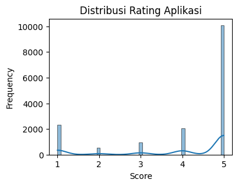
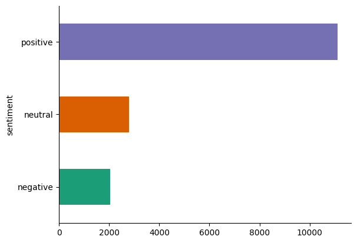
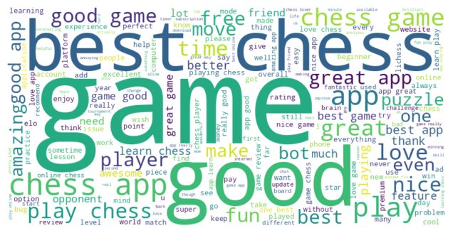
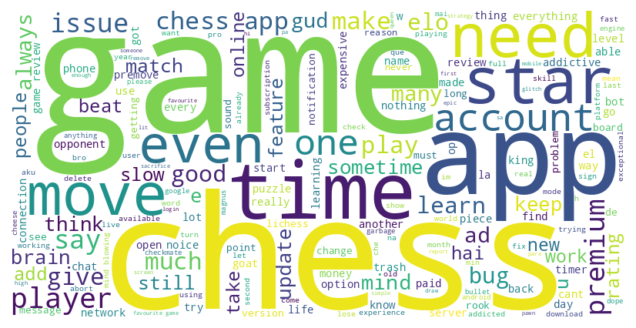
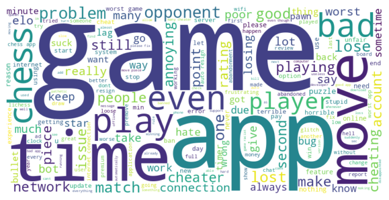

<h1><center>Chess.com Reviews App Sentiment Analysis</center></h1>

This project focuses on sentiment analysis of user reviews on the Chess.com application to understand opinions, satisfaction levels, and areas that need improvement.

This project has 4 training schemes:

1. SVM, TF-IDF, 80/20
2. Random Forest, TF-IDF, 80/20
3. Logistic Regression, n-gram, 80/20
4. GRU, n-gram, 80/20

## Data Scraping

The data used for this sentiment analysis project is taken from user reviews of the **Chess.com** application on the **Google Play Store** in English. The scraped data consists of around 20,000 records using the google-play-scraper library, and approximately 16,000 records after data cleaning. Saved as `chess.csv`

-   Scrape Date : 16-01-2025
-   App Name: Chess - Play and Learn
-   App ID: com.chess
-   App Developer: Chess.com
-   App Summary: Play chess online with friends! Learn with lessons, puzzles & analysis!
-   App Installs: 50,000,000+
-   App Reviews: 39347

## Data Cleaning

The data cleaning process includes removing duplicates and missing values in reviews. The final dataset consists of 15,925 records with 2 columns: `content`, `score`.

## Exploratory Data Analysis



## Data Preprocessing

The data preprocessing steps include:

1. Convert text to lowercase.
2. Remove HTML tags using BeautifulSoup.
3. Remove URLs using regular expressions.
4. Remove special characters and punctuation, keeping only alphabetic characters and spaces.
5. Tokenize the text into individual words.
6. Remove stopwords using NLTK's stopwords corpus.
7. Lemmatize the words using NLTK's WordNetLemmatizer.
8. Join the processed words back into a single string.

Here is an example of how to apply the preprocessing function to a DataFrame column named 'content':

```python
import nltk
import re
from nltk.corpus import stopwords
from nltk.stem import WordNetLemmatizer
from bs4 import BeautifulSoup

nltk.download('stopwords')
nltk.download('wordnet')

stop_words = set(stopwords.words('english'))
lemmatizer = WordNetLemmatizer()

def preprocess_text(text):
    text = text.lower()
    text = BeautifulSoup(text, "html.parser").get_text()
    text = re.sub(r"http\S+|www\S+|https\S+", '', text, flags=re.MULTILINE)
    text = re.sub(r'[^a-zA-Z\s]', ' ', text)
    text = re.sub(r'[ ]+', ' ', text)
    words = text.split()
    words = [word for word in words if word not in stop_words]
    words = [lemmatizer.lemmatize(word) for word in words]
    text = ' '.join(words)
    return text

df['processed_content'] = df['content'].apply(preprocess_text)
```

## Data Labelling (VADER Sentiment)

Data labelling is done using **VADER (Valence Aware Dictionary and Sentiment Reasoner)** for each preprocessed data row.
VADER is a lexicon and rule-based sentiment analysis tool that is specifically attuned to sentiments expressed in social media. It is fully open-sourced under the **MIT License**.

## Sentiement Distribution



### Positive Sentiment Wordcloud



### Neutral Sentiment Wordcloud



### Negative Sentiment Wordcloud




## Training Schemes & Results

After performing training and testing for the three schemes, the results are as follows:

1. SVM, TF-IDF, 80/20
```
Train Accuracy: 0.97
Test Accuracy: 0.92
```
2. Random Forest, TF-IDF, 80/20
```
Train Accuracy: 0.99
Test Accuracy: 0.89
```
3. Logistic Regression, n-gram, 80/20
```
Train Accuracy: 0.99
Test Accuracy: 0.92
```
3. GRU, n-gram, 80/20
```
Train Accuracy: 0.95
Test Accuracy: 0.88
```

Ranking based on Testing and Training accuracy:
1. Logistic Regression, n-gram, 80/20 👑
2. SVM, TF-IDF, 80/20
3. Random Forest, TF-IDF, 80/20
4. GRU, n-gram, 80/20

*see notebook for more details*

---

That's all for now! 🚀

If you have any questions or feedback, feel free to make a pull request or open an issue 😀

*Joshua Palti Sinaga*